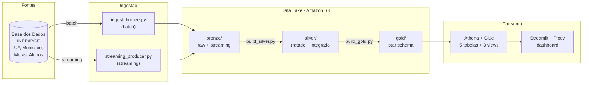

# Tech Challenge Fase 2 — Pipeline Híbrida de Alfabetização no Brasil (AWS)

Pipeline híbrida (batch + streaming) para análise do **Indicador Criança Alfabetizada** (Compromisso Nacional Criança Alfabetizada, INEP/IBGE via Base dos Dados), construída sobre arquitetura Medalhão em nuvem AWS, com governança, qualidade de dados e otimização de custos (FinOps).

---

## 1. Contexto do problema

A alfabetização na infância é um pilar do desenvolvimento educacional, social e econômico. O **Compromisso Nacional Criança Alfabetizada** mobiliza União, estados, DF e municípios para garantir que toda criança esteja alfabetizada até o fim do 2º ano do ensino fundamental.

A partir da Pesquisa Alfabetiza Brasil (2023) e do ponto de corte de 743 pontos na escala Saeb, foi criado o **Indicador Criança Alfabetizada**, que expressa o percentual de estudantes que atingem esse patamar de proficiência. A meta nacional é a universalização até 2030.

Compreender os fatores que influenciam a alfabetização exige integrar fontes heterogêneas — metas nacionais, estaduais e municipais, dados territoriais e microdados de desempenho. Esta pipeline integra essas fontes para subsidiar políticas públicas baseadas em evidências e análises de desigualdade educacional.

---

## 2. O desafio

Atuando como time de engenharia de dados de uma organização pública de análise educacional, o objetivo é construir uma **pipeline híbrida (batch + streaming)** que integre as fontes do indicador de alfabetização, garantindo **qualidade, escalabilidade e eficiência de custos** em nuvem, seguindo a **Arquitetura Medalhão** (Bronze, Silver, Gold).

---

## 3. Arquitetura da solução

Pipeline híbrida sobre arquitetura Medalhão (Bronze → Silver → Gold), 100% em AWS.



### Fluxo de dados

1. **Batch** — `ingest_bronze.py` baixa as tabelas da Base dos Dados e grava Parquet na Bronze (S3), sem transformações.
2. **Streaming** — `streaming_producer.py` simula eventos em tempo quase real, gravando micro-batches particionados por data/hora em `bronze/streaming/`.
3. **Silver** — `build_silver.py` lê a Bronze do S3, limpa, padroniza chaves, faz *unpivot* das metas (wide → long), valida qualidade e integridade referencial, e grava a Silver no S3.
4. **Gold** — `build_gold.py` lê a Silver, monta o modelo dimensional (fato + dimensões) e grava a Gold no S3.
5. **Consumo** — Athena cataloga a Gold via Glue e serve as views; o dashboard Streamlit consulta via `awswrangler`.

---

## 4. Camadas (Arquitetura Medalhão)

### Bronze — Dados Brutos
Dados ingeridos das fontes sem transformação, com histórico completo preservado e metadados de rastreabilidade (`_ingestao_timestamp`, `_fonte`). Inclui a partição de streaming (`bronze/streaming/`, particionada por data/hora).

### Silver — Dados Tratados
Limpeza, padronização de tipos e chaves, tratamento de valores ausentes, *unpivot* das metas (colunas → linhas) e **integração das bases**. Validação de consistência e integridade referencial. 5 tabelas materializadas (~62 mil linhas):

| Tabela | Descrição | Linhas |
|---|---|---|
| `municipio_resultado` | Resultados por município | 23.995 |
| `uf_resultado` | Resultados por UF | 145 |
| `meta_municipio` | Metas municipais (long) | 37.464 |
| `meta_uf` | Metas por UF (long) | 189 |
| `meta_brasil` | Metas nacionais (long) | 7 |

### Gold — Camada Analítica
Star schema (Kimball) pronto para dashboards, análise estatística e ML:

| Tabela | Grão / Chave | Linhas |
|---|---|---|
| `dim_uf` | sigla_uf | 27 |
| `dim_municipio` | id_municipio | 5.571 |
| `dim_tempo` | ano | 8 |
| `dim_nivel` | nivel_alfabetizacao | 6 |
| `fato_alfabetizacao` | id_municipio + ano | 43.008 |

**Views analíticas** (consumidas pelo dashboard): `vw_uf_ano`, `vw_regiao_ano`, `vw_municipio` — indicador de alfabetização, comparação metas × resultados e evolução temporal.

---

## 5. Tecnologias utilizadas

| Ferramenta | Papel | Justificativa da escolha |
|---|---|---|
| **Amazon S3** | Data lake (3 camadas) | Storage barato e durável, Parquet nativo, suporte a particionamento |
| **AWS Glue Catalog** | Catálogo de metadados | Serverless, integra nativamente com Athena |
| **Amazon Athena** | Query engine | Serverless, custo por query, lê o S3 direto sem carga prévia |
| **awswrangler** | I/O Python ↔ S3/Athena | Abstrai leitura/escrita de Parquet e execução de queries |
| **Streamlit + Plotly** | Dashboard | Desenvolvimento rápido, interativo, custo zero de hospedagem |
| **AWS CloudShell / CLI / IAM** | Provisionamento e acesso | Nativo da nuvem, sem setup local, credenciais gerenciadas |

---

## 6. Decisões arquiteturais (trade-offs)

**Batch vs streaming** — Batch para carga histórica densa (metas, municípios, agregados nacionais); streaming para simular atualização contínua de indicadores e novas medições. A natureza analítica do problema (histórico + eventos incrementais) justifica a pipeline **híbrida**.

**Data lake vs data warehouse** — Optou-se por **data lake (S3) + query engine (Athena)** em vez de um data warehouse dedicado. Não há cluster ocioso, o custo é proporcional ao uso, e o Parquet particionado entrega performance suficiente para o volume do projeto. Um warehouse dedicado só se justificaria com cargas de consulta muito maiores e concorrência alta.

**Custo vs performance** — Parquet + Snappy + particionamento reduzem a quantidade de dados escaneados, que é o que define custo e latência no Athena. Para o volume atual, a latência serverless é plenamente aceitável e o custo, mínimo — priorizou-se eficiência de custo sem perda relevante de performance.

---

## 7. Monitoramento e FinOps

### Monitoramento
- **Logging estruturado** por camada (`config/logger.py`), com contagem de linhas lidas e gravadas em cada etapa.
- **Relatório de qualidade consolidado** ao fim de cada camada (duplicatas, nulos em chave, % nulo médio, integridade referencial).
- **Tratamento de falhas por tabela** na ingestão — uma falha isolada não derruba o lote inteiro; falhas são logadas e reportadas ao fim.
- **Rastreabilidade** — metadados de ingestão (`_ingestao_timestamp`, `_fonte`) em cada registro da Bronze.
- **Volume processado** registrado em log a cada materialização de camada.

### FinOps — otimização de custos
- **Armazenamento eficiente:** Parquet + Snappy + particionamento (Bronze por `ano`; streaming por `data/hora`).
- **Otimização de queries:** o Athena escaneia apenas as partições necessárias; as views pré-agregam o consumo do dashboard, reduzindo dados lidos por acesso.
- **Controle de recursos:** arquitetura **serverless** (S3 + Athena) — zero infraestrutura ociosa, sem custo fixo de cluster.
- **Estimativa de custo:** para o volume atual (Gold ~330 KiB, Silver ~680 KiB), o custo mensal fica na ordem de centavos de dólar. A ingestão streaming é feita direto no S3, mantendo custo próximo de zero na operação contínua.

**Decisões que reduzem custo operacional:** ausência de cluster dedicado (serverless), formato colunar comprimido, particionamento que limita o scan por query, e reuso de um dashboard leve (Streamlit) em vez de uma ferramenta de BI paga.

---

## 8. Aplicação em IA

A camada Gold, com grão município + ano e dimensões territoriais, habilita:

- **Predição de alfabetização** — modelos que estimam o risco de um município não atingir a meta, a partir de features territoriais (região, mesorregião, região metropolitana, Amazônia Legal) já presentes nas dimensões.
- **Análise de desigualdade educacional** — clusterização de municípios por perfil de desempenho, identificando bolsões de vulnerabilidade.
- **Políticas públicas baseadas em dados** — priorização de municípios por gap frente à meta, comparação de efetividade entre regiões e monitoramento da trajetória rumo a 2030. A view `vw_municipio` já entrega gap e status de meta prontos para o gestor.

---

## 9. Estrutura do repositório

```
config/                    settings (AWS) + logger
ingestion/batch/           ingest_bronze.py (camada Bronze)
layers/
  bronze/                  README da camada
  silver/                  build_silver.py
  gold/                    build_gold.py + build_views.py
quality/                   validations.py (qualidade + integridade)
dashboard/                 app.py (Streamlit -> Athena)
docs/evidencias/           prints de execucao
export_gold_to_s3.py       materializacao da Gold no S3
export_silver_to_s3.py     materializacao da Silver no S3
streaming_producer.py      ingestao streaming (simulada)
.env.example               variaveis de ambiente
```

---

## 10. Como executar

**Pré-requisitos:** Python 3.11+, conta AWS com S3/Athena, credenciais via `aws configure` (região `us-east-1`).

```bash
git clone https://github.com/leonardoaz98/aws-tech-challenge2-fiap.git
cd aws-tech-challenge2-fiap

pip install awswrangler boto3 pandas streamlit plotly basedosdados python-dotenv
cp .env.example .env        # preencher as variaveis
aws configure               # us-east-1, json

# Pipeline batch (Medalhao)
python3 ingestion/batch/ingest_bronze.py    # Bronze
python3 layers/silver/build_silver.py       # Silver
python3 layers/gold/build_gold.py           # Gold
python3 layers/gold/build_views.py          # Views no Athena

# Streaming (evidencia de execucao)
python3 streaming_producer.py --batches 10 --intervalo 2

# Dashboard
streamlit run dashboard/app.py
```

---

## 11. Qualidade de dados

Validações reutilizáveis aplicadas na promoção entre camadas (`quality/validations.py`):

- **Duplicidade** — registros duplicados na chave de negócio.
- **Valores ausentes** — nulos em colunas-chave e % nulo médio.
- **Integridade referencial** — chaves da tabela filha conferidas contra a dimensão.
- **Consistência entre tabelas** — validação cruzada fato × dimensões.

Falha de qualidade em chave (duplicata ou nulo) bloqueia a promoção entre camadas; o relatório consolidado registra o status de cada tabela.

---

## 12. Fonte de dados

Base dos Dados — dataset `br_inep_avaliacao_alfabetizacao` (Indicador Criança Alfabetizada, INEP/IBGE).
